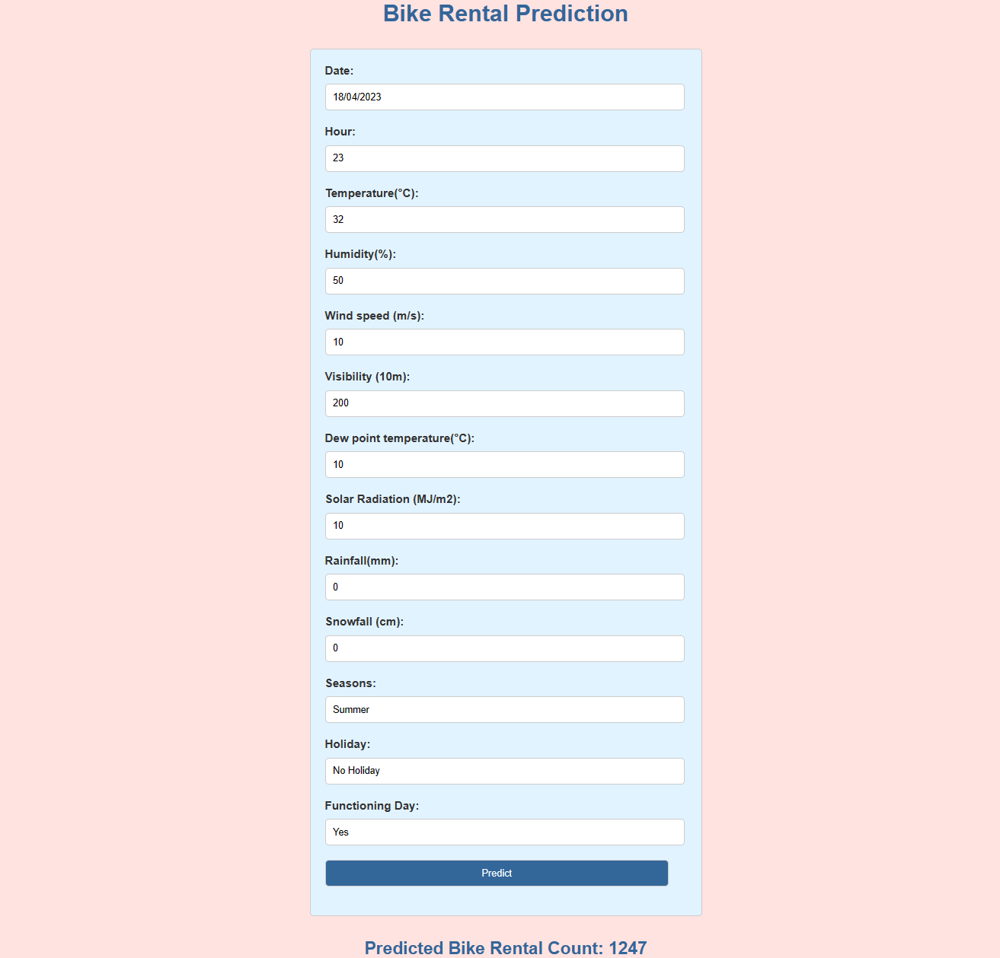

# **Seoul's Two Wheeled Future**
## Introduction
In our quest for a more sustainable future, one crucial area that requires our attention is transportation. The heavy reliance on fossil fuels and the consequent pollution caused by traditional modes of transportation pose significant challenges to our environment and contribute to the looming threat of climate change. However, by embracing sustainable transportation solutions, we can pave the way towards a greener and cleaner future. This project explores the importance of sustainable transportation and to address environmental concerns, one solution could be to use bikes(bicycle) to travel and create a more sustainable society.  
Rental bikes have been introduced in numerous urban cities to improve mobility convenience. Ensuring the availability and accessibility of rental bikes to the public at the appropriate times is crucial in reducing waiting times. Consequently, maintaining a stable supply of rental bikes becomes a significant challenge. A key aspect of addressing this challenge is accurately predicting the required bike count for each hour, enabling the city to maintain a consistent supply of rental bikes. The dataset available for analysis includes weather information (such as temperature, humidity, windspeed, visibility, dewpoint, solar radiation, snowfall, and rainfall), the number of bikes rented per hour, and date information. By leveraging this dataset, accurate predictions can be made to optimize the distribution and availability of rental bikes throughout the day.

## Dataset Information

- **Date :** year-month-day
- **Rented Bike count :** Count of bikes rented at each hour
- **Hour :** Hour of he day
- **Temperature :** Temperature in Celsius
- **Humidity :** %
- **Windspeed :** m/s
- **Visibility :** 10m
- **Dew point temperature :** Celsius
- **Solar radiation :** MJ/m2
- **Rainfall :** mm
- **Snowfall :** cm
- **Seasons :** Winter, Spring, Summer, Autumn
- **Holiday :** Holiday/No holiday
- **Functional Day :** NoFunc(Non Functional Hours), Fun(Functional hours)

## EDA
You can find all the graphs in [seoul-s-two-wheeled-future.ipynb](seoul-s-two-wheeled-future.ipynb). 
We plotted data and extracted some meaningful information:
- The demand is very low on 1st, 2nd and 12th day. We can service the bikes on those days
- Rainfall and Snowfall are highly corelated with demand and with each other
- When temprature is low the demand is low as well.
- We can also see the demand with the respect to time of day, in the hours when demand is high we can raise prices and vice-versa.
- Demand is high at 8 and 18 hour, it maybe office hours.
- Dew point temperature and temperature are highly correlated. One of them can be removed
- Dew point temperature and humidity is highly correlated

## Model Training and Testing
We trained and tested the following models:
- LinearRegression
- Ridge Regression
- Lasso Regression
- Polynomial Regression
- Support Vector Regressor
- KNeighborsRegressor
- Decision Tree Regressor 
- Random Forest Regressor
- XGBRegressor

out of these the two best performing models were Random Forest and XGBoost.  
We then used RandomizedSearchCV for hypertuning. XGBRegressor with best_params gave the best parameter.  

## Evaluation
- With the best model the evaluation metrics we got: 

********************
**Tuned XGBRegressor:**
********************
**MSE: 29321.286 
RMSE: 171.235 
MAE: 105.064 
R2: 0.932**

## Pipeline
We made a pipeline with columntransformer containing date transformer, OneHotEncoder. 
We then added StandardScaler and tuned XGBRegressor.  
We then pickled it and tested in [inference.ipynb](inference.ipynb).

We then created flask app for users in [app.py](app.py)

## **Conclusion**
The model is predicting Rental bike demand:  
 
We can improve this project and it can help us move towards a more sustainable future. Embracing sustainable transportation is a vital step towards a more sustainable future. By reducing carbon emissions, improving air quality, enhancing energy efficiency, fostering innovation, and building resilient communities, we can mitigate the adverse impacts of transportation on our environment and work towards a greener society. It is imperative that governments, businesses, and individuals collaborate to support and invest in sustainable transportation solutions. Let us embrace this transformative journey and pave the way for a future free from fossil fuel pollution and the looming threat of climate change. Together, we can create a world where sustainable transportation is the norm, enabling us to lead more sustainable lives and leave a better planet for future generations.
